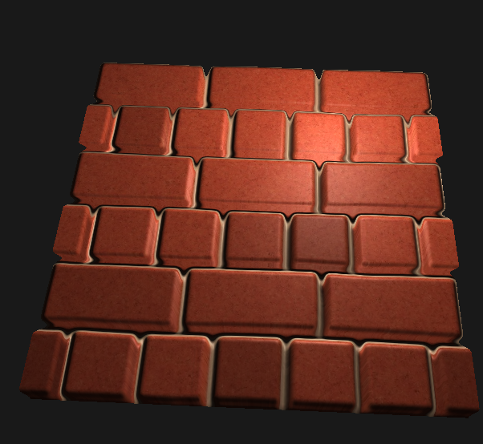

##*MultiTexturing*

-----
**CMake Build instructions**

-----
 ***WARNING : NVIDIA driver is hardcoded in CMakeLists.txt***
 - Out-of-source build :
 ```
git clone git@github.com:Modelisation5ETI/TP8_Texture.git && \
mkdir TP8_Texture-build && cd TP8_Texture-build  && \
cmake ../TP8_Texture  && \
make -j
 
 ```
  - QtCreator :
 ```
git clone git@github.com:Modelisation5ETI/TP8_Texture.git  && \
mkdir TP8_Texture-build && cd TP8_Texture-build  && \
qtcreator ../TP8_Texture
 
 ```
  *Then configure project using QtCreator API* : 
   - *Set the build directory to TP8_Texture-build/*
   - *Run CMake and build project*


-----
**Implementation**

-----

 - ### Parallax
 

 ```
 ./Parallax
 ```
 Use arrows UP/DOWN to increase/decrease depth.
 
 - ### Bidon
 

 ```
 ./Bidon
 ```
 Use arrow LEFT/RIGHT to rotate camera.

 - ### Caillou
 

 ```
 ./Caillou
 ```
 Use arrow LEFT/RIGHT to rotate camera.

